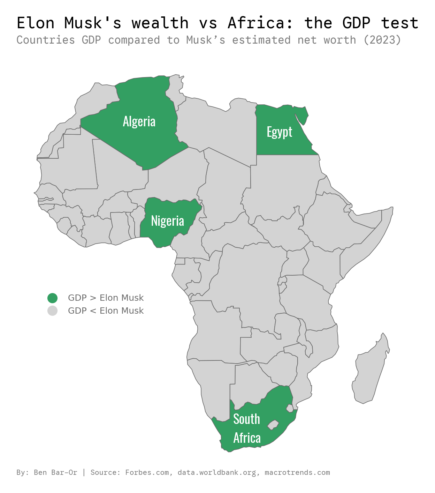

# African Economies vs Elon Musk

---

## 📊 Visualisation

This project maps African countries whose 2023 GDP surpasses Elon Musk’s estimated net worth. 
While the comparison is imperfect, it is indicative enough for the purpose of this exercise, aiming to convey a sense of scale rather than precise figures. 
It is a hands-on exercise in collecting, cleaning, and merging data, as well as visualizing geographic information using Python and GeoPandas.

---

## 📂 For a deeper look 

To see how the map was created, check out the Jupyter Notebook:
[elon map.ipynb](elon%20map.ipynb)
